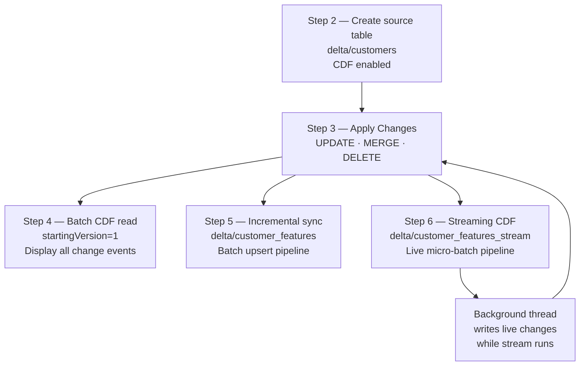

# Delta Lake Change Data Feed (CDF) Demo

A self-contained PySpark demo that walks through every major aspect of
**Delta Lake Change Data Feed (CDF)**: enabling it, reading the feed in batch
mode, building an incremental downstream pipeline, and consuming the feed with
a live structured streaming query.

---

## What Is Delta Lake CDF?

Change Data Feed (CDF) is a Delta Lake feature that automatically records every
row-level change (insert, update, delete) made to a table. Each change is
annotated with a `_change_type` (`insert`, `update_preimage`,
`update_postimage`, or `delete`), a `_commit_version`, and a
`_commit_timestamp`. Downstream consumers can read only the rows that changed
since their last checkpoint instead of scanning the entire table.

---

## Data Flow



---

## Project Structure

```
.
├── main.py                  # Full demo — all 6 steps in one script
├── pyproject.toml           # Dependencies (managed with uv)
├── uv.lock                  # Locked dependency versions
├── .python-version          # Python 3.14 pinned for uv
├── delta/                   # Generated at runtime — Delta tables & checkpoints
│   ├── customers/           # Source table (CDF enabled)
│   ├── customer_features/   # Batch incremental sync target (Step 5)
│   ├── customer_features_stream/  # Streaming sink (Step 6)
│   └── checkpoints/         # Spark streaming checkpoint (Step 6)
├── delta_rs_test.py         # Standalone deltalake (Rust) read test
└── test_delta.py            # Additional unit tests
```

> The `delta/` directory is created automatically on the first run and is safe
> to delete between runs (see [Re-running Cleanly](#re-running-cleanly)).

---

## Prerequisites

| Requirement | Version | Notes |
|---|---|---|
| Java (JDK) | 17 or 21 | PySpark 4.x requires JDK 17+. `java -version` must be on your `PATH`. |
| Python | 3.14 | Pinned in `.python-version`. |
| [uv](https://docs.astral.sh/uv/) | latest | Fast Python package manager used to create the venv and install deps. |

### Install uv (if not already installed)

```bash
# macOS / Linux
curl -LsSf https://astral.sh/uv/install.sh | sh

# Windows (PowerShell)
powershell -ExecutionPolicy ByPass -c "irm https://astral.sh/uv/install.ps1 | iex"
```

### Verify Java

```bash
java -version
# Expected: openjdk version "17.x.x" or "21.x.x"
```

If Java is missing, install [Eclipse Temurin 17](https://adoptium.net/) or any
OpenJDK 17/21 distribution.

---

## Setup

```bash
# 1. Clone or navigate to the project root
cd delta-lake-change-data-feed-cdf-demo

# 2. Create the virtual environment and install all dependencies
uv sync
```

`uv sync` reads `pyproject.toml` and `uv.lock`, creates `.venv/`, and installs
the exact locked versions listed below:

| Package | Locked version |
|---|---|
| pyspark | 4.1.1 |
| delta-spark | 4.3.0 |
| deltalake | 1.6.1 |
| pandas | 3.0.3 |
| pyarrow | 24.0.0 |

---

## Running the Demo

```bash
uv run python main.py
```

The script takes roughly **45–60 seconds** to complete — the extra time is the
30-second streaming window in Step 6.

You will see Spark's INFO/WARN log lines interleaved with the demo's own
`print` output. Two warnings are expected and harmless:

- `spark.sql.adaptive.enabled is not supported in streaming DataFrames/Datasets and will be disabled`
  — AQE is automatically disabled for streaming queries.
- `Failed to cancel job group ... Cannot find active jobs for it`
  — Logged when `query.stop()` is called between micro-batches (no job in
  flight to cancel).

---

## Expected Output

### Step 2 — Source table created

```
Customers table created with CDF enabled.
```

Five customer rows are written to `delta/customers` with
`delta.enableChangeDataFeed = true`.

### Step 3 — Changes applied

```
Updated Alice's tier to Platinum
Merged updates — Bob relocated, Frank joined
Deleted Eve's record (churn)
```

Three operations are committed as Delta versions 1, 2, and 3:

| Version | Operation | Who |
|---|---|---|
| 1 | UPDATE | Alice: Silver → Platinum |
| 2 | MERGE | Bob: Delhi → Hyderabad; Frank inserted |
| 3 | DELETE | Eve removed |

### Step 4 — Batch CDF read

```
+-----------+-------+--------+-----------+-------------------+--------------+-------------------------+
|customer_id|name   |tier    |city       |_change_type       |_commit_version|_commit_timestamp       |
+-----------+-------+--------+-----------+-------------------+--------------+-------------------------+
|1          |Alice  |Silver  |Mumbai     |update_preimage    |1             |2024-...                 |
|1          |Alice  |Platinum|Mumbai     |update_postimage   |1             |2024-...                 |
|2          |Bob    |Silver  |Delhi      |update_preimage    |2             |2024-...                 |
|2          |Bob    |Silver  |Hyderabad  |update_postimage   |2             |2024-...                 |
|6          |Frank  |Bronze  |Kolkata    |insert             |2             |2024-...                 |
|5          |Eve    |Silver  |Chennai    |delete             |3             |2024-...                 |
+-----------+-------+--------+-----------+-------------------+--------------+-------------------------+
```

Each change appears as one or two rows:
- **`update_preimage`** — the row before the update.
- **`update_postimage`** — the row after the update.
- **`insert`** — a newly inserted row.
- **`delete`** — the row that was deleted.

### Step 5 — Incremental sync

```
Processing versions 1 → 3
Deleted 1 records
Upserted 3 records
Sync complete. New checkpoint version: 3
```

`delta/customer_features` is created/updated with only the latest state of
each changed customer (pre-images and deletes are filtered out).

### Step 6 — Streaming CDF

```
Streaming CDF pipeline running
[live] Charlie upgraded to Gold
[live] New customer Grace inserted
Streaming CDF pipeline stopped

Contents of the streaming sink (delta/customer_features_stream):
+-----------+-------+--------+-----------+------+-------------------+
|customer_id|name   |tier    |city       |...   |signup_date        |
+-----------+-------+--------+-----------+------+-------------------+
|1          |Alice  |Platinum|Mumbai     |...   |2024-01-01 ...     |
|2          |Bob    |Silver  |Hyderabad  |...   |2024-01-02 ...     |
|3          |Charlie|Gold    |Bangalore  |...   |2024-01-03 ...     |
|4          |Diana  |Gold    |Pune       |...   |2024-01-04 ...     |
|6          |Frank  |Bronze  |Kolkata    |...   |2024-11-01 ...     |
|7          |Grace  |Silver  |Jaipur     |...   |2024-12-01 ...     |
+-----------+-------+--------+-----------+------+-------------------+
```

The stream:
1. Replays the historical CDF events from version 1 in the first micro-batch
   (every 5 seconds).
2. Picks up the live `UPDATE` on Charlie (~8 s after start).
3. Picks up the live `INSERT` of Grace (~16 s after start).
4. Stops cleanly after 30 seconds.

---

## Re-running Cleanly

The `delta/` directory stores the Delta tables and the streaming checkpoint.
On a second run, the checkpoint causes the stream to skip already-processed
versions (which is the correct production behaviour), and the batch sink
(`delta/customer_features`) will already exist.

To start completely fresh:

```bash
# Linux / macOS
rm -rf delta/

# Windows (PowerShell)
Remove-Item -Recurse -Force delta/
```

Then re-run:

```bash
uv run python main.py
```

---

## Dependency Notes

- **`delta-spark`** provides the PySpark-facing Delta APIs (`DeltaTable`,
  `configure_spark_with_delta_pip`). It automatically downloads the matching
  Delta JARs at startup.
- **`deltalake`** (Rust-based) is also installed and used in `delta_rs_test.py`
  for reading Delta tables without a Spark session.
- **`pyarrow`** and **`pandas`** are required by `deltalake` for in-process
  data materialisation.
